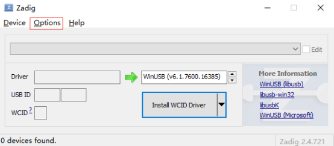
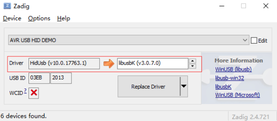

Efinity软件安装
一、软件安装
Efinity软件安装比较简单，只需要点“next”就可以了，不需要作任何设置

二、USB驱动安装（只能进行SPI下载）
Linux：
如果还没安装，使用命令：
sudo <installation directory>/bin/install_usb_driver.sh

Windows：
1. 从zadig.akeo.ie下载并安装Zadig
2. PC插上板子
3. 打开Zadig，选择Options > List All Devices
4. 选择目标芯片
5. Driver选择libusbK (version)
6. 点击Replace Driver
注：如果有多个不同的设备，不同设备都需要安装驱动

下面是Windows下安装T8开发板 USB驱动例子：
打开Zadig，选择Options > List All Devices

选择AVR USB DEMO

Driver选择libusbK (version)

T8开发板

T20F169开发板

T20F169开发板（JTAG）

点击Replace Driver

然后我们打开Efinity的Programme，可以看到已经找到设备

三、开发板JTAG下载
安装libusb-win32-devel-filter-1.2.6.0，安装后打开界面，选择“Install a device filter”

选择ID跟开发板芯片ID一样的，但是Description写的是USB Composite Device（如下图，找到Description为Trion T20xxxx，ID为vid:0403 pid：6010 rev:0700，找到这个ID对应的USB Composite Device）

安装完后，就可以进行JTAG下载了

四、C232HM-DDHSL下载线连接（
JTAG：
TCK      - 橙
TDI       - 黄
TDO      - 绿
TMS      - 棕
CRESETN  - 灰
GND      - 黑
SPI active（AS模式）
CLK      - 橙
MOSI     - 黄
MISO     - 绿
SS        - 棕
CRESETN  - 灰
GND      - 黑
